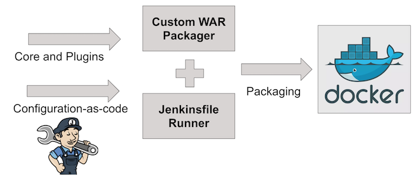
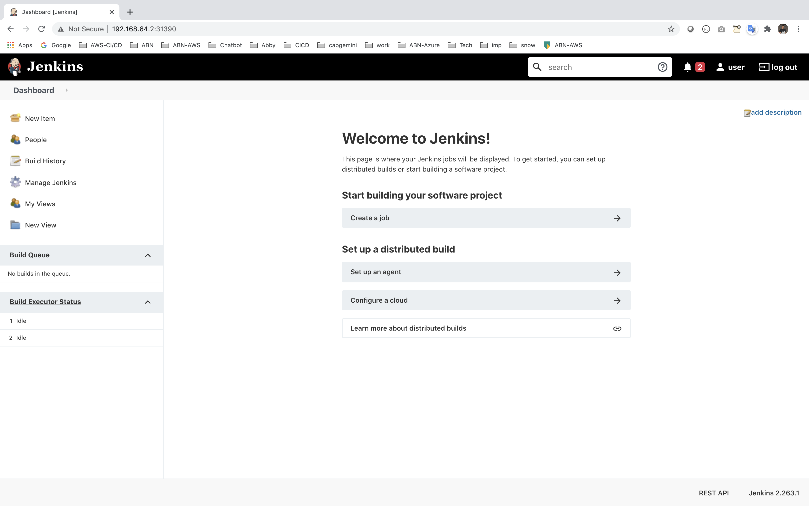

# - Create a Helm chart that deploys the following:
## - Jenkins server
###  	- Jenkins should be exposed to the internet
###   	- Create a pipeline using jenkinsfile that builds a docker image to run a sample war 


Prerequisites
Helm command line interface
If you don’t have Helm command line interface installed and configured locally, see the sections below to Install Helm and Configure Helm.

Install Helm
To install Helm CLI, follow the instructions from the Installing Helm page.
https://helm.sh/docs/intro/install/

### - Create a pipeline using jenkinsfile that builds a docker image to run a sample war 



Check minikube status
```
minikube start
```
```
$ minikube service list
|----------------------|---------------------------|--------------|---------------------------|
|      NAMESPACE       |           NAME            | TARGET PORT  |            URL            |
|----------------------|---------------------------|--------------|---------------------------|
| default              | kubernetes                | No node port |
| default              | kubernetes-bootcamp       |         8080 | http://192.168.64.2:31555 |
| default              | my-release-jenkins        | http/80      | http://192.168.64.2:31390 |
|                      |                           | https/443    | http://192.168.64.2:30406 |
| kube-system          | kube-dns                  | No node port |
| kubernetes-dashboard | dashboard-metrics-scraper | No node port |
| kubernetes-dashboard | kubernetes-dashboard      | No node port |
|----------------------|---------------------------|--------------|---------------------------|

```
Install helm chat!!
```
brew install helm
```
```
helm repo add bitnami https://charts.bitnami.com/bitnami
```

Install Jenkins service with helm 
```
helm install my-release bitnami/jenkins
```

After installtion  Output log for Jenkins.
```
$ helm install my-release bitnami/jenkins
NAME: my-release
LAST DEPLOYED: Sun Jan 10 17:43:38 2021
NAMESPACE: default
STATUS: deployed
REVISION: 1
TEST SUITE: None
NOTES:
** Please be patient while the chart is being deployed **

1. Get the Jenkins URL by running:

** Please ensure an external IP is associated to the my-release-jenkins service before proceeding **
** Watch the status using: kubectl get svc --namespace default -w my-release-jenkins **

  export SERVICE_IP=$(kubectl get svc --namespace default my-release-jenkins --template "{{ range (index .status.loadBalancer.ingress 0) }}{{.}}{{ end }}")
  echo "Jenkins URL: http://$SERVICE_IP/"

2. Login with the following credentials

  echo Username: user
  echo Password: $(kubectl get secret --namespace default my-release-jenkins -o jsonpath="{.data.jenkins-password}" | base64 --decode)
```

Link for access Jenkins service in local
http://192.168.64.2:31390

  

Jenkinsfile for Pipeline creation for Java simple project

```
pipeline {
    agent {
        docker {
            image 'maven:3-alpine'
            args '-v /root/.m2:/root/.m2'
        }
    }
    options {
        skipStagesAfterUnstable()
    }
    stages {
        stage('Build') {
            steps {
                sh 'mvn -B -DskipTests clean package'
            }
        }
        stage('Test') {
            steps {
                sh 'mvn test'
            }
            post {
                always {
                    junit 'target/surefire-reports/*.xml'
                }
            }
        }
        stage('Deliver') { 
            steps {
                sh './jenkins/scripts/deliver.sh' 
            }
        }
    }
}

```

## Create your initial Pipeline as a Jenkinsfile
You’re now ready to create your Pipeline that will automate building your Java application with Maven in Jenkins. Your Pipeline will be created as a Jenkinsfile.

a. Initially queues the project to be run on the agent.

b. Downloads the Maven Docker image and runs it in a container on Docker.


The Blue Ocean interface turns green if Jenkins built your Java application successfully.


